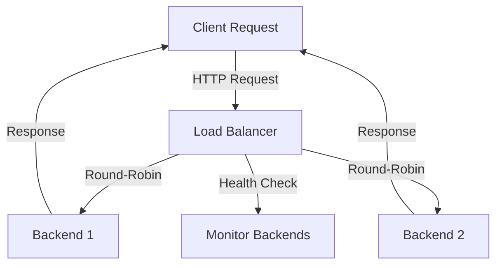

# Load Balancer Project

This repository contains a load balancer implementation in Go along with a basic backend server. The load balancer distributes incoming requests across multiple backend servers, ensuring efficient resource utilization and fault tolerance.

## Folder Structure

```
repo/
 |- backend/
 |   |- backend.go
 |- load-balancer/
     |- load-balancer.go
```

### File Descriptions

1. **`backend/backend.go`**:
   - A simple HTTP server that listens on a specified port.
   - It responds with a message indicating that the backend server is running.

2. **`load-balancer/load-balancer.go`**:
   - The core load balancer implementation.
   - Distributes requests among multiple backend servers using a round-robin algorithm.
   - Performs health checks to ensure backend servers are available.

---

## Features

- **Round-Robin Load Balancing**: Ensures an even distribution of requests across backend servers.
- **Health Checks**: Periodically verifies the availability of backend servers.
- **Retries**: Automatically retries requests if a backend server fails.
- **Dynamic Configuration**: Backends can be configured via command-line arguments.

---

## Setup and Usage

### Prerequisites
- Go installed on your system (version 1.16+).

### Steps to Run

1. Clone the repository:
   ```bash
   git clone <repository_url>
   cd repo
   ```

2. Build and run the backend servers:
   ```bash
   cd backend
   go build -o backend-server backend.go
   PORT=8081 ./backend-server &
   PORT=8082 ./backend-server &
   ```

3. Build and run the load balancer:
   ```bash
   cd ../load-balancer
   go build -o load-balancer load-balancer.go
   ./load-balancer -backends=http://localhost:8081,http://localhost:8082 -port=3030
   ```

4. Access the load balancer:
   Open your browser and navigate to `http://localhost:3030`. The requests will be distributed across the backend servers.

---

## Workflow Diagram

Below is a simplified workflow of the Load Balancer system:



---

## Configuration

### Command-Line Flags

- `-backends`: Comma-separated list of backend server URLs (e.g., `http://localhost:8081,http://localhost:8082`).
- `-port`: Port for the load balancer to listen on (default: `3030`).

---

## Example Logs

```plaintext
2024/12/21 12:00:00 Configured server: http://localhost:8081
2024/12/21 12:00:00 Configured server: http://localhost:8082
2024/12/21 12:00:01 Load balancer started at :3030
2024/12/21 12:01:00 Selected backend: http://localhost:8081
2024/12/21 12:01:05 Selected backend: http://localhost:8082
2024/12/21 12:02:00 Starting health check...
2024/12/21 12:02:00 http://localhost:8081 [up]
2024/12/21 12:02:00 http://localhost:8082 [up]
2024/12/21 12:02:00 Health check completed
```

---

## Future Improvements

- Add support for weighted load balancing.
- Implement SSL termination at the load balancer level.
- Enhance monitoring and alerting for backend server health.

---

## License
This project is licensed under the MIT License.

---

## Contributing
Feel free to open issues or submit pull requests for improvements or bug fixes.

